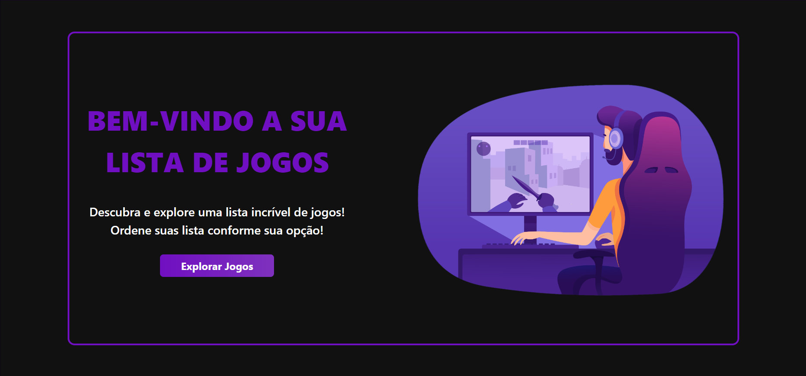
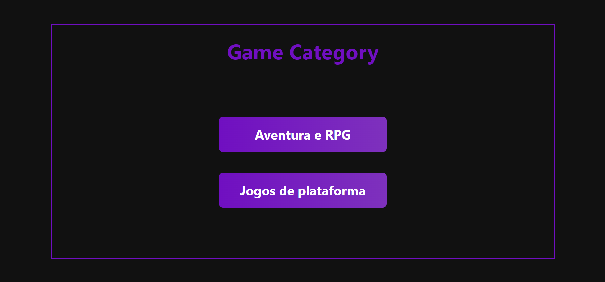
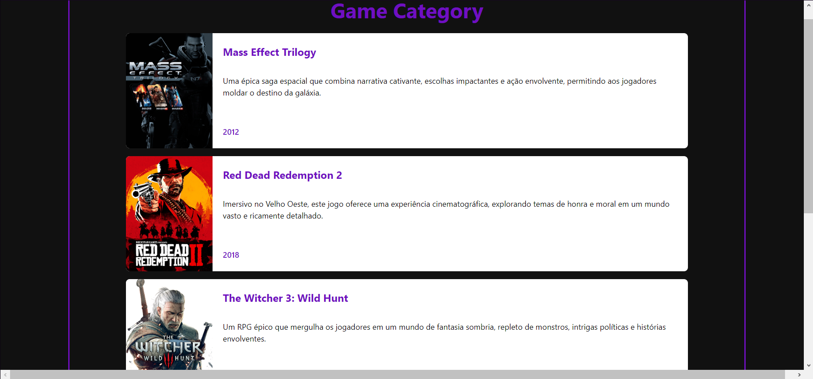
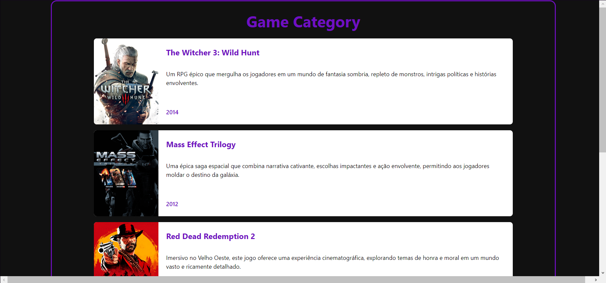
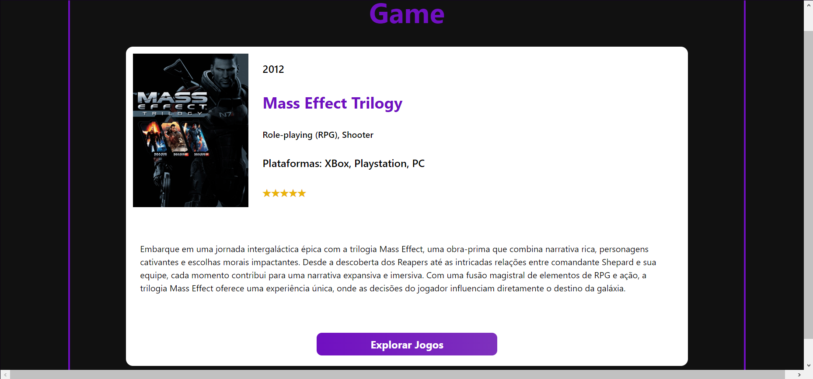
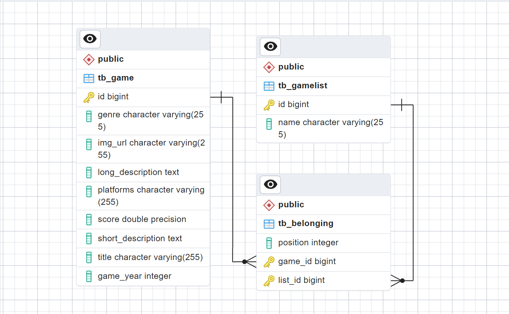

# GameList 

# Sobre o projeto

Este projeto é uma aplicação feita para você organizar sua lista de jogos na web.

A aplicação consiste em uma listagem de games, onde você pode organizar os jogos de acordo com o gênero, podendo classificar conforme sua preferência.

## Layout web

## Modelo conceitual

# Tecnologias utilizadas

## Back-end
- Java
- Spring Boot
- JPA / Hibernate
- Maven
- Banco de dados: Postgresql
  
## Front-end
Feito por: [Felipe Rossetto](https://github.com/Feliperosscoder)
- TailwindCSS
- ReactJS

# Autor

Rafael Augusto e [Felipe Rossetto](https://github.com/Feliperosscoder)

 
 

